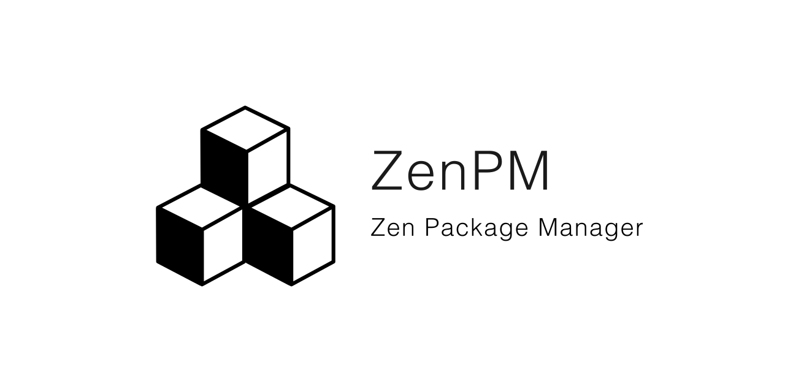
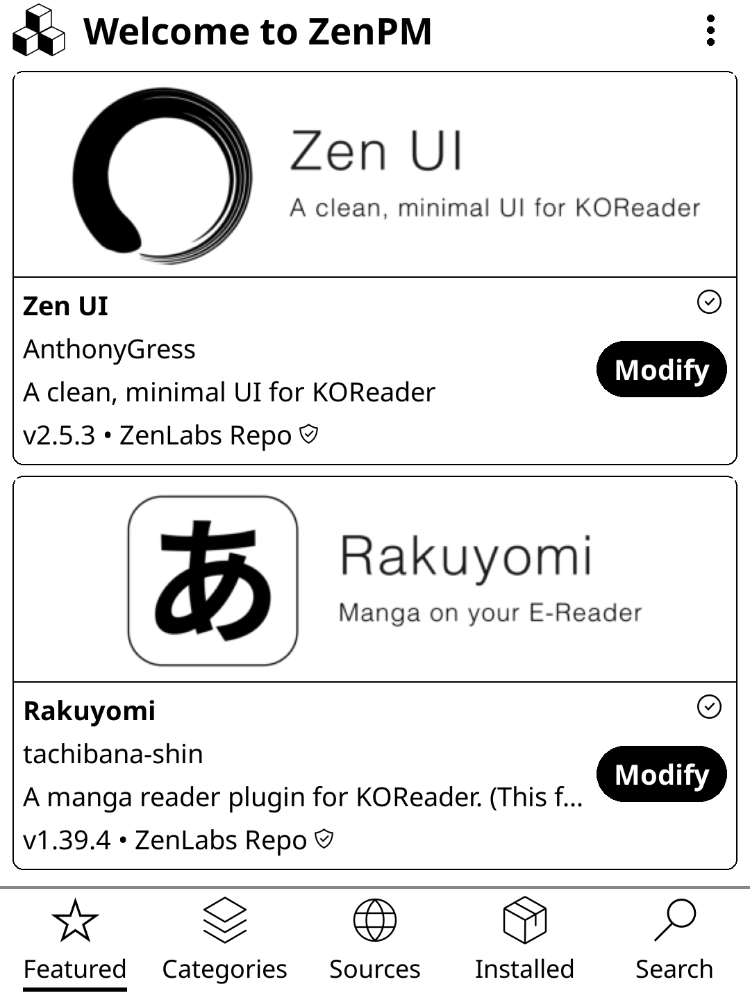
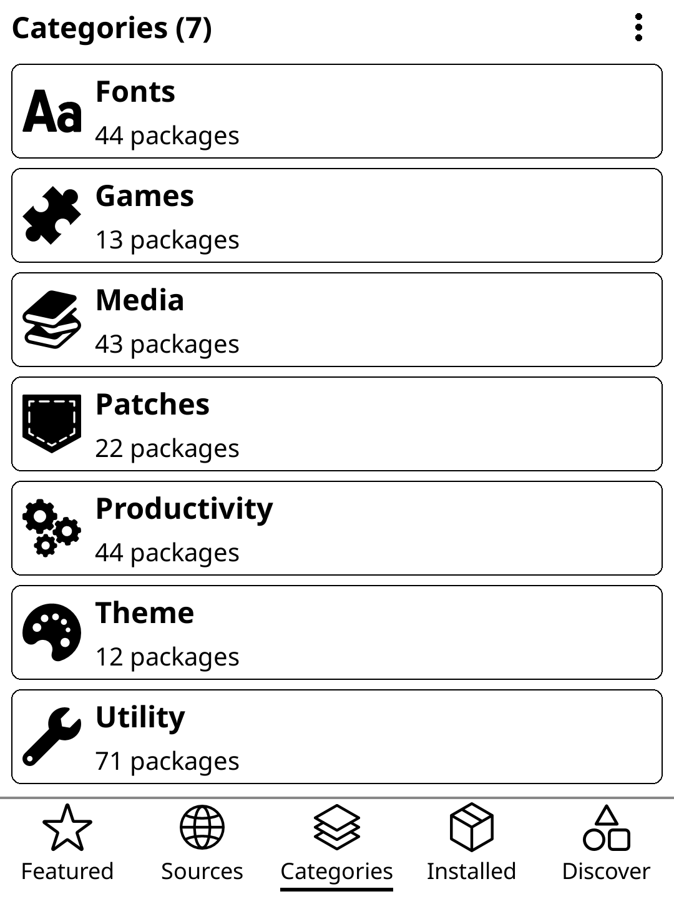
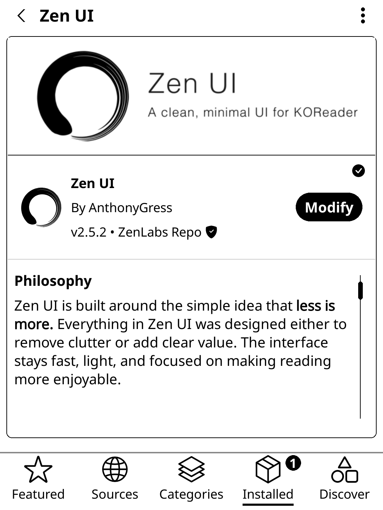
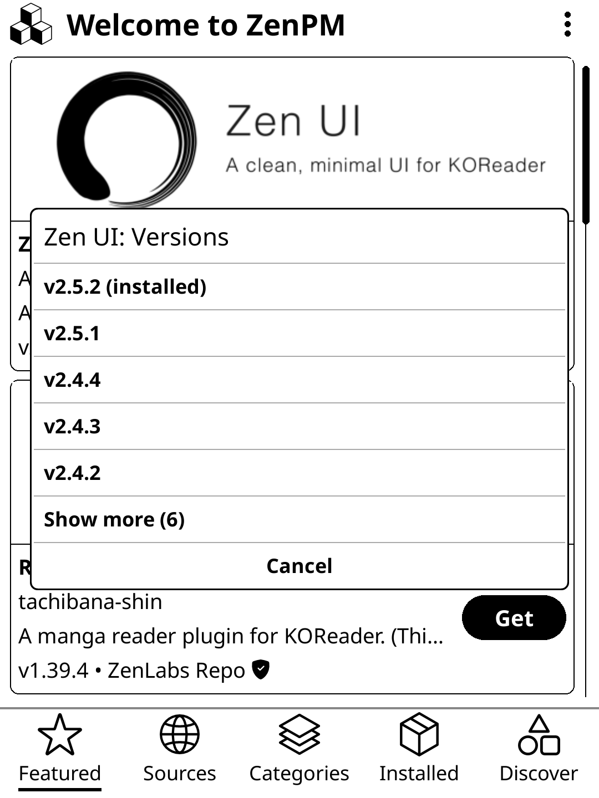
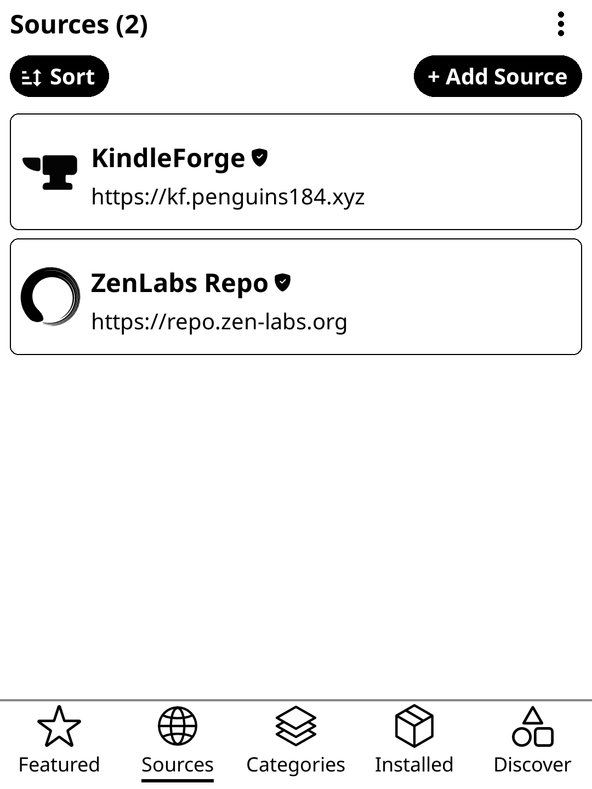
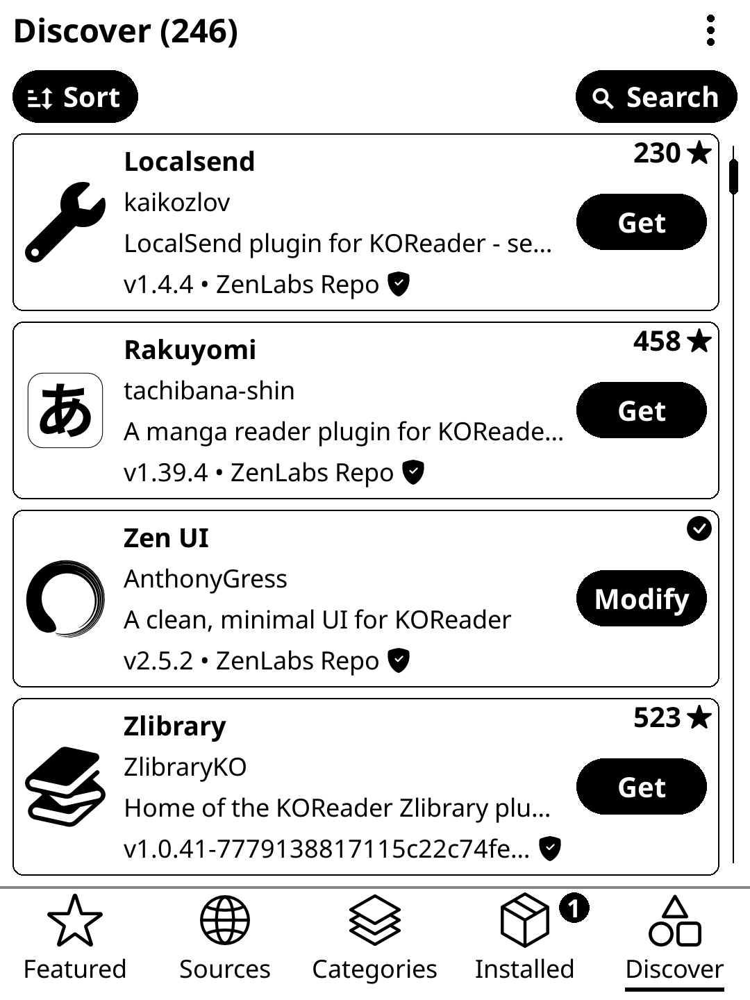
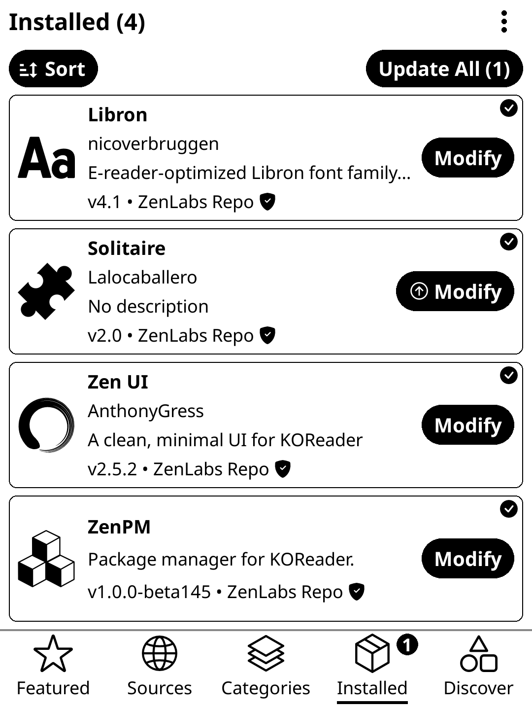
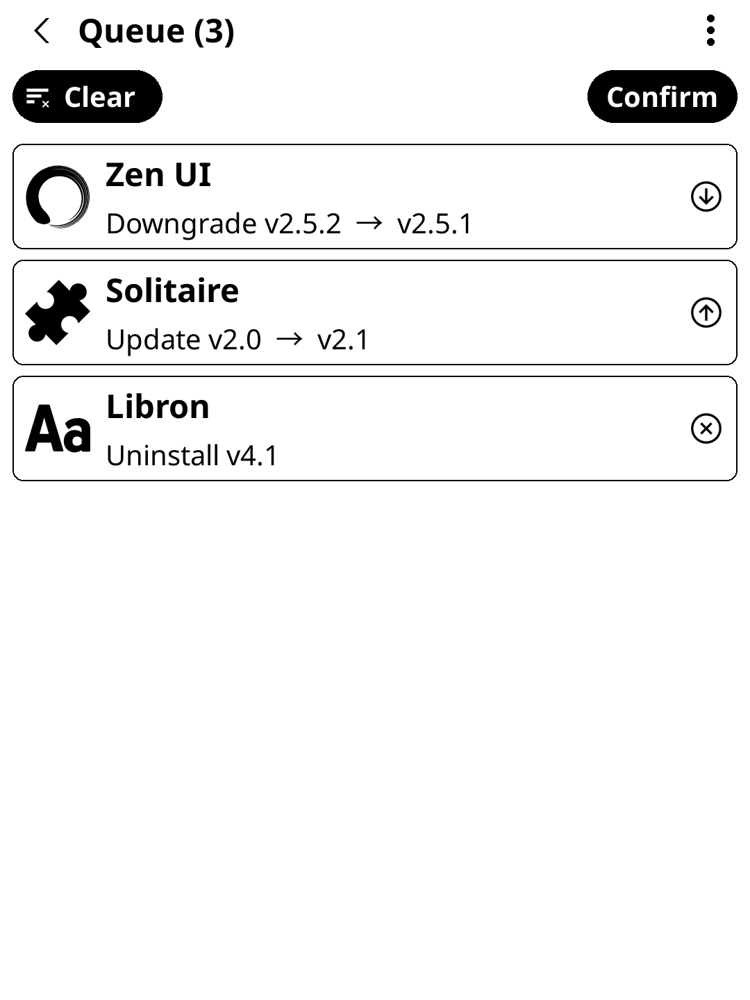
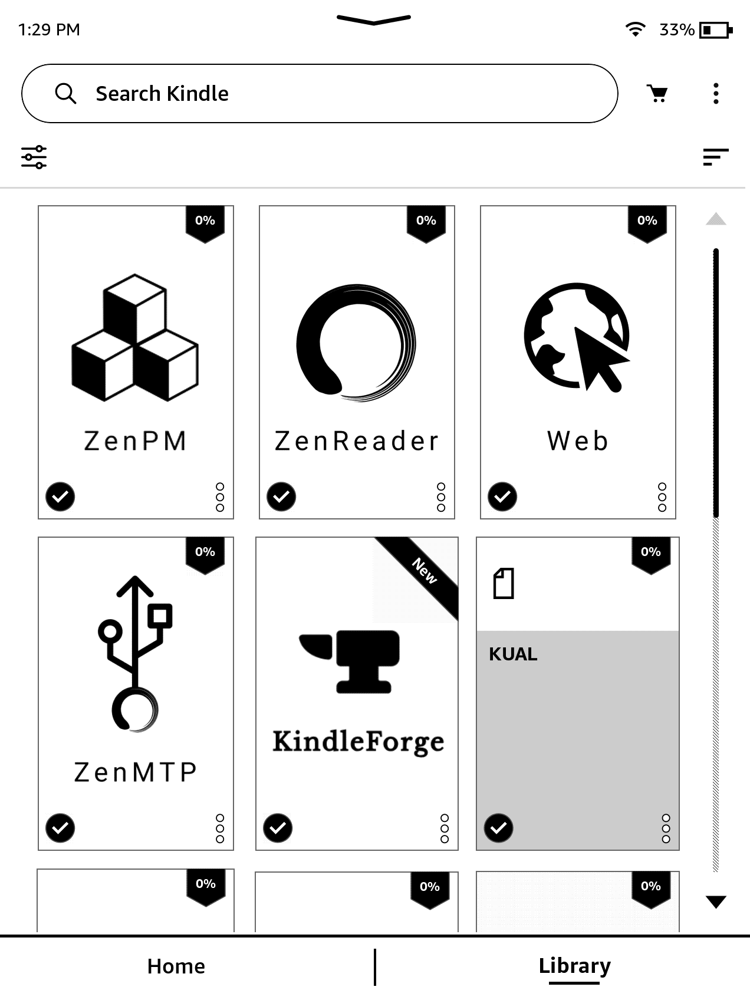

# ZenPM

**A package manager for jailbroken Kindles and KOReader.** Browse trusted
package repositories and install, update, reinstall, or remove packages from
one interface.

[Website](https://zen-labs.org/zen-pm) · [Releases](https://github.com/xZenLabs/ZenPM/releases) · [Installation guide](docs/installation.md) · [Discord](https://discord.gg/Tv2PhrCPQ8)

ZenPM is available as a standalone Kindle app and as a KOReader plugin. The
same package model supports KOReader on Kindle, Kobo, Android, Linux, and
macOS.

## What it does

ZenPM brings package discovery and lifecycle management to e-readers:

| Capability | What you can do |
| --- | --- |
| Browse packages | Explore featured packages, categories, and individual sources. |
| Search and inspect | Search the available catalog and open package details before acting. |
| Manage installs | Install, update, reinstall, or remove packages. |
| Track your setup | See installed packages and available updates in one place. |
| Manage sources | Review the built-in repositories or add your own compatible repository. |
| Queue changes | In the KOReader plugin, review several install, update, or removal actions before confirming them. |
| Work safely | Operations are serialized and performed by a local daemon bound only to the device. |

On Kindle, ZenPM has a native WAF interface. In KOReader, ZenPM appears in the
KOReader menu and keeps its managed backend and state in KOReader's settings
directory.

## ZenPM in action

  
  
  

  
  
  

  
  
  

## Install

If you have Zen UI, install ZenPM from **Extras > Install ZenPM**.

Otherwise:

Download files from the [latest release](https://github.com/xZenLabs/ZenPM/releases).
Use files from the same release. Beta releases are prereleases; enable **Beta
updates** in ZenPM only if you want in-app beta updates.

### Kindle standalone

This option requires a Kindle jailbreak that provides root access. It also
needs the device's sqlite3 binary and a script launcher such as KUAL. Do not
install the standalone package on any setup without root access.

> [!WARNING]
> As with KindleForge, using ZenPM Kindle Standalone on WinterBreak, SpringBreak, Sanctuary, or
> similar devices—anything with a `JAILBREAK` booklet—is strongly discouraged
> to prevent future conflicts and other issues with KPM. This will be resolved
> in a future update.

Most of the Kindle standalone frontend is based on work from the
[KindleForge project](https://github.com/KindleTweaks/KindleForge).

1. Download ZenPM-kindle-standalone-<version>.zip.
2. Extract it to the Kindle USB-storage root (/mnt/us). It creates
   documents/ZenPM.sh and ZenPM/.
3. Safely eject the Kindle and run documents/ZenPM.sh from KUAL or another
   script launcher.
4. Open ZenPM from the Kindle launcher.

To launch it again from an SSH session:

~~~sh
lipc-set-prop com.lab126.appmgrd start app://com.zenpm.waf
~~~

### KOReader plugin

1. Download the ZenPM KOReader ZIP that matches your device.
2. Extract it. The result must be a folder named zenpm.koplugin, not a ZIP
   inside another zenpm.koplugin folder.
3. Copy that folder into KOReader's plugins/ directory.
4. Restart KOReader and open **ZenPM** from the KOReader menu.

The plugin selects and manages its bundled backend automatically. Its files
live under KOReader's settings directory in ZenPM/, so they survive plugin
updates.

| Device or runtime | Download |
| --- | --- |
| KOReader on a 32-bit Kindle or Kobo | ZenPM-koreader-ereader-<version>.zip |
| KOReader on ARM64 Kobo, including (some) Kobo Libra Colour | ZenPM-koreader-linux-<version>.zip |
| KOReader on Android | ZenPM-koreader-android-<version>.zip and ZenPM-android-<version>.apk |
| KOReader on macOS | ZenPM-koreader-macos-<version>.zip |
| KOReader on Linux desktop | ZenPM-koreader-linux-<version>.zip |

Android needs both the companion APK and the KOReader plugin: Android does not
allow the plugin to run its bundled backend directly. Install the APK with
Android's package installer (or adb install -r), then install the plugin and
grant the requested storage access when KOReader starts it.

The e-reader ZIP includes both ARM hard-float and soft-float backends. If you
need to identify a device:

~~~sh
if [ "$(uname -m)" = aarch64 ] || [ "$(uname -m)" = arm64 ]; then
  echo arm64
elif [ -f /lib/ld-linux-armhf.so.3 ]; then
  echo hf
else
  echo sf
fi
~~~

Use the Linux ZIP when the result is arm64; use the e-reader ZIP for either
32-bit ABI.

## Use ZenPM

Start by letting ZenPM refresh its sources. The user interface then gives you:

- **Featured** for highlighted packages.
- **Categories** and **Search** to find packages.
- **Sources** to inspect repositories and add compatible ones.
- **Installed** to see what is present and update it.
- **Package details** to review package metadata, assets, and the available
  action.
- **Queue** in KOReader to stage multiple changes and confirm them together.

Select a package to install it. For an installed package, choose **Update**,
**Reinstall**, or **Remove** as appropriate. ZenPM resolves the compatible
asset before it runs the operation. The KOReader plugin also offers automatic
update checks, a beta-update switch, an installable-package filter, and an
installed-plugin scan.

### Command line

The zenpm binary can also be used through SSH, an on-device terminal, or the
terminal that launches the KOReader emulator.
The `zpm` alias is also available and accepts the same commands.

~~~sh
# Check the device and inspect logs.
zenpm doctor
zenpm logs --tail 200

# Manage repositories. Refresh after changing them.
zenpm repo list
zenpm repo add my-repo https://example.com/my-repo/
zenpm repo refresh
zenpm repo remove my-repo

# Browse the refreshed catalog.
zenpm list
zenpm list koreader
zenpm list installed
zenpm info <package-id>

# Change packages.
zenpm install <package-id>
zenpm uninstall <package-id> [patch-file]
zenpm update
zenpm update <package-id>
~~~
OR using `zpm` command
~~~sh
# All the same commands for zenpm work
zpm doctor
zpm list
~~~

The first launch seeds the ZenLabs repository. Compatible Kindles also seed
KindleForge. User-added
repositories are refreshed from their URL and assigned trust automatically.

### Updates and removal

On Kindle, use **Update** from ZenPM's three-dot system menu. It checks the
release metadata, validates the selected download, replaces the payload, and
keeps persistent settings. The equivalent manual command is:

~~~sh
sh /mnt/us/ZenPM/update.sh
~~~

To remove the Kindle standalone installation, call POST /uninstall on the
local daemon. Add ?remove_settings=true only when you also want to delete
/mnt/us/.ZenPM/.

## Troubleshooting and data

To report a bug from the app, open the three-dot menu and select **Report a
Bug**. This will include all the necessary information to help quickly solve your issue by uploading the ZenPM logs. You can also ask the community in [Discord](https://discord.gg/Tv2PhrCPQ8).

Run zenpm doctor first: it reports the active platform, state home, cache,
database, log, and relevant device prerequisites.

| Installation | Log location |
| --- | --- |
| Kindle standalone | /mnt/us/ZenPM/ZenPM.log |
| KOReader plugin | KOReader settings directory / ZenPM / ZenPM.log |
| Kobo standalone | /mnt/onboard/.adds/ZenPM/ZenPM.log |
| Host development | ~/.zenpm/ZenPM.log |

For Kindle, live-tail the log with:

~~~sh
tail -f /mnt/us/ZenPM/ZenPM.log
~~~

Persistent repositories, installed-package records, and the merged catalog are
stored in a SQLite database outside the Kindle/Kobo payload directory, so they
survive application updates. KOReader uses its own database inside its ZenPM
settings directory.

## Repository authors

ZenPM accepts two static repository formats and detects them automatically:

- ZenPM native: manifest.json at the repository root.
- KindleForge compatibility: registry.json at the repository root.

A native repository is ordinary static hosting. It describes package metadata
in manifest.json and points to package install and uninstall scripts. Host it
on GitHub Pages, raw GitHub, or any HTTPS static host, then users can add the
repository from **Sources** or with zenpm repo add.

Use HTTPS. ZenPM can verify a manifest.json.sig Ed25519 signature and labels
unsigned or plain-HTTP repositories accordingly. See the
[repository-index contract](docs/architecture/repository-index.md) and the
[local API reference](docs/api/openapi.yaml) for the complete schema and API.

## Build and develop

Building requires Go 1.22+ and FontTools (pyftsubset). Builds use the SemVer
version already in `VERSION` and overwrite the prior `dist/` artifacts. Update
`VERSION` and `frontend/koreader/zenpm.koplugin/_meta.lua` together only when
preparing a new release, then run:

~~~sh
./build.sh
~~~

Build artifacts are written to dist/. For local CLI and frontend development:

~~~sh
go build -o zenpm ./cmd/zenpm
export ZENPM_HOME="$PWD/.zenpm-dev"
export ZENPM_PLATFORM=host
./zenpm serve --port 18765
~~~

Use a separate emulator state while testing package changes:

~~~sh
export ZENPM_HOME="$PWD/.zenpm-emulator"
export ZENPM_PLATFORM=host
ZENPM_DRY_RUN=1 ./zenpm install <script-backed-package-id>
~~~

Dry-run skips shell package scripts. Generic KOReader plugin installs run
in-process, so point ZENPM_KOREADER_ROOT at a disposable KOReader profile
before testing them.

## Safety

- KOReader connects to the daemon through a local Unix-domain socket, except
  on Android, where the separately installed companion uses a loopback-only
  HTTP listener. Neither is exposed on the network.
- Package scripts execute on the device; review the source and package details
  before installing software from an unfamiliar repository.
- Do not run package installs without dry-run on a non-Kindle/Kobo host.

## License and contribution

ZenPM is released under the repository's [GPL-3.0 license](LICENSE). Read
[CONTRIBUTING.md](CONTRIBUTING.md) before opening a change, and use
[GitHub Issues](https://github.com/xZenLabs/ZenPM/issues) for bugs or ideas.
